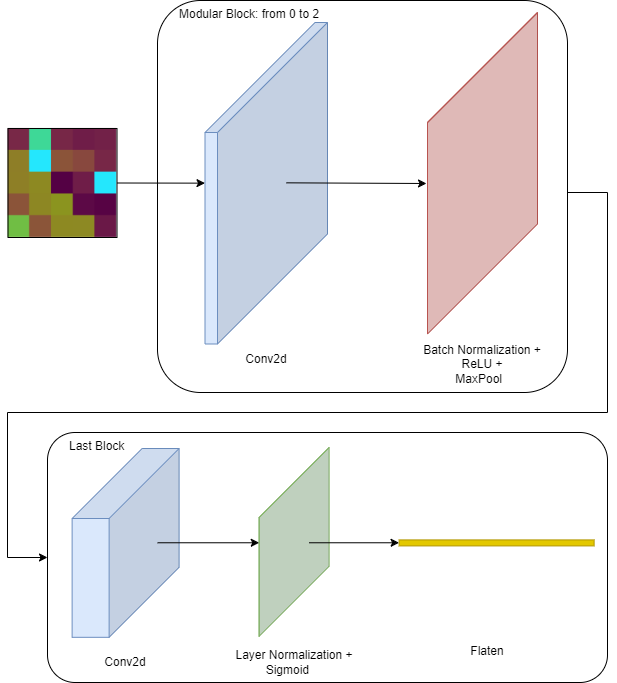

# Thesis Experiments and Results

This folder contains all the experiments, data, and results from my Master's thesis:

> **Interpretable Hybrid Models for Tabular Data: Integrating Kolmogorov–Arnold and Convolutional Networks via Synthetic Images**

based on and extending the [pykan](https://github.com/KindXiaoming/pykan) repository.

---

## 🎯 Project Overview

This thesis investigates hybrid modeling architectures that combine KAN networks and CNNs for tabular data transformed into synthetic images. The research addresses the following objectives:

- Replacing traditional MLPs with KAN networks to achieve improved interpretability and competitive performance.
- Integrating CNNs trained on synthetic images to leverage spatial patterns in tabular data.
- Comparing different tabular-to-image transformation methods (IGTD, REFINED, TINTO).
- Introducing the **Global Feature Score** as a unified interpretability metric.
- Evaluating various concatenation strategies between the CNN and KAN branches.
- Exploring branch relevance and feature importance to enhance model interpretability.

---

## 🗂 Repository Structure

```bash
gio_notebooks/
├── data/                              # CSV datasets for training and evaluation
├── results/                           # CSV files with results and metrics from grid search
├── images/                            # Diagrams and figures used in thesis documentation
│   ├── cnn_blocks.png
│   ├── full_methodology_process.png
│   └── grid_seach_methodology_v1.svg
├── dataset-GridSearch-SM.ipynb        # Jupyter notebooks for dataset to execute base Grid Searchs using SM synthetic method (e.g. Puma-Regression-GridSearch-IGTD.ipynb) 
├── dataset-Concat-SM.ipynb            # Jupyter notebooks for dataset to execute concatenation strategies Grid Searchs using SM synthetic method (e.g. Puma-Regression-Concat-IGTD.ipynb)
├── dataset-Final-Results-SM.ipynb     # Jupyter notebooks for dataset to execute concatenation strategies Grid Searchs using SM synthetic method (e.g. Puma-Regression-Final-Results-IGTD.ipynb)
└── README.md                      # This file
```

---

## 📚 Contents of This Repository

The repository includes:

- **Datasets**: CSV files used for training and evaluating models.
- **Jupyter Notebooks**:
  - Generation of synthetic images from tabular datasets.
  - Grid searches over KAN, CNN, and hybrid CNN–KAN architectures.
  - Testing and comparison of multiple concatenation strategies.
  - Replication of best experimental results for each dataset.
  - Calculation and analysis of the proposed **Global Feature Score**.
- **Results**: Detailed experimental outcomes stored in CSV format, supporting reproducibility.

This repository aims to enable reproducibility and serve as a foundation for future research on hybrid architectures for tabular data.

---

## 🖼 Methodology Diagrams

### CNN Blocks Architecture



---

### Full Hybrid Model Methodology


---

### Grid Search Methodology

*(SVG files render directly on GitHub. For maximum compatibility, consider using PNG in other Markdown viewers.)*


---

## 🚀 How to Run Experiments

To replicate experiments:

### Step 1: Clone Repository

```bash
git clone https://github.com/giomondragon/pykan.git
cd pykan/gio_notebooks
```

### Step 2: Set Up Environment (Conda)

```bash
conda env create -f ../environment.yml
conda activate pykan
```

### Step 3: Start Jupyter Lab

```bash
jupyter lab
```

Run the provided notebooks directly from Jupyter Lab to explore and replicate results.

---

## 🔗 Related Repositories

- Original pykan library: [KindXiaoming/pykan](https://github.com/KindXiaoming/pykan)

---

## 📄 License

This work inherits the license of the original pykan repository ([MIT License](https://opensource.org/licenses/MIT)). The materials here are provided for academic and research purposes.

---

## ✨ Acknowledgments

I would like to thank the authors of the original pykan library and the community contributors for developing and sharing tools essential to this research.
